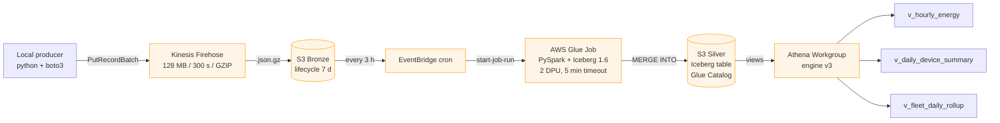

# AWS Data Lakehouse — Serverless Energy Telemetry

A fully-destroyable, serverless AWS data lakehouse provisioned with Terraform.
Simulated energy-meter telemetry lands in S3 via Kinesis Firehose, is
transformed by an AWS Glue PySpark job into an Apache Iceberg Silver table,
and is exposed as three Athena Gold views.

Built as a personal portfolio project. Hard budget ceiling: **$10 USD total**.
Everything comes up with `terraform apply` and goes away with `terraform destroy`.



## Stack at a glance

| Layer | Service | Why |
|---|---|---|
| Ingestion | Kinesis Data Firehose (Direct PUT) | Zero-idle, managed buffer to S3 |
| Bronze | S3 + GZIP JSON | Cheapest raw storage, 7-day lifecycle |
| ETL | AWS Glue 5.0 (PySpark, Iceberg 1.6) | Serverless Spark — no cluster to forget |
| Silver | Apache Iceberg on S3 + Glue Catalog | ACID, schema evolution, `MERGE INTO` for idempotency |
| Gold | Athena views (engine v3) | $0 storage — materializes on query |
| Schedule | EventBridge cron `cron(0 */3 * * ? *)` | Every 3 h — keeps 7-day demo under $5 |
| Guardrails | AWS Budgets + SNS email + Athena scan-cutoff | Defense-in-depth for the budget |
| IaC | Terraform ~> 5.80, Terraform >= 1.6 | Everything as code, single-command lifecycle |

## Prerequisites

- AWS account with no Service Control Policies blocking Glue/Firehose/Athena
- `terraform >= 1.6`
- `aws` CLI v2 (used by Terraform's `local-exec` provisioners)
- `python >= 3.10` (for the local producer; the Glue runtime is independent)
- An AWS profile with permissions to create the resources in this stack

## Deploy

```bash
# 1. Configure variables
cd terraform
cp terraform.tfvars.example terraform.tfvars
$EDITOR terraform.tfvars    # at minimum set alert_email

# 2. Provision
terraform init
terraform apply

# 3. Confirm the SNS email subscription in your inbox (budget alerts)

# 4. Capture the producer credentials
terraform output -raw producer_access_key_id
terraform output -raw producer_secret_access_key
aws configure --profile te-lake-producer   # paste both values

# 5. Run the producer (from repo root)
cd ..
python -m venv .venv && source .venv/bin/activate
pip install -r producer/requirements.txt
eval "$(terraform -chdir=terraform output -raw run_producer_command)"
# ...records now flowing into Firehose...

# 6. Wait up to ~5 min for first delivery, then up to 3 h for the next
#    scheduled Glue run (or fire it manually):
aws glue start-job-run --job-name "$(terraform -chdir=terraform output -raw glue_job)"

# 7. Query the Gold views in Athena (select workgroup `te-lake-*-analytics-wg`):
#    SELECT * FROM te_lake_gold.v_hourly_energy LIMIT 20;
#    SELECT * FROM te_lake_gold.v_daily_device_summary ORDER BY total_kwh DESC LIMIT 10;
#    SELECT * FROM te_lake_gold.v_fleet_daily_rollup;
```

See [`docs/athena-queries.sql`](docs/athena-queries.sql) for more sample queries.

## Destroy

```bash
# Stop the producer first (Ctrl-C), then:
cd terraform
terraform destroy
```

The destroy completes in ≈ 2–3 min; everything is torn down including:

- Glue Iceberg table (dropped by a `null_resource` destroy-time hook before the DB goes)
- All three Gold views (dropped via `DROP VIEW IF EXISTS`)
- All S3 buckets (have `force_destroy = true`, so data goes with them)
- IAM user + access key (auto-rotated on next apply)
- Firehose stream, Glue job, EventBridge rule, Athena workgroup, Budget, SNS

## Cost

7-day continuous demo — expected total **~$2.15**:

| Service | Driver | Cost |
|---|---|---|
| Glue Job | 2 DPU × 5 min × 8 runs/day × 7 d | ~$2.05 |
| Firehose | ~100 MB ingested | < $0.01 |
| S3 | ~50 MB across 3 buckets | < $0.05 |
| Athena | Views on MB-sized scans | < $0.01 |
| EventBridge, SNS, CloudWatch Logs | Free tier | $0 |

Budgets alert fires at 50/80/100 % of your configured `budget_limit_usd` via email.

## Repo layout

```
.
├── README.md                     # ← you are here
├── docs/
│   ├── architecture.md           # deeper architecture doc with rationale
│   └── athena-queries.sql        # copy-paste queries for the 3 Gold views
├── fake_data_generator/          # pre-existing — untouched
├── producer/
│   ├── producer.py               # local IoT simulator -> Firehose
│   ├── requirements.txt
│   └── README.md                 # producer-specific run instructions
├── terraform/
│   ├── backend.tf
│   ├── providers.tf
│   ├── variables.tf
│   ├── locals.tf
│   ├── main.tf                   # module wiring
│   ├── outputs.tf
│   ├── terraform.tfvars.example
│   └── modules/
│       ├── storage/              # 3 S3 buckets + lifecycle + SSE
│       ├── ingestion/            # Firehose + IAM + producer user
│       ├── catalog/              # Glue databases (silver, gold)
│       ├── etl/                  # Glue job + EventBridge + initial-run hook
│       │   └── scripts/bronze_to_silver.py
│       ├── query/                # Athena workgroup + 3 Gold views
│       │   └── views/*.sql.tftpl
│       └── observability/        # Budgets + SNS email alerts
└── .github/workflows/
    └── terraform-ci.yml          # fmt / validate on PR
```

## Design decisions

Full write-up in [`docs/architecture.md`](docs/architecture.md). Highlights:

- **Glue 5.0 + Iceberg 1.6 bundled** — activated via `--datalake-formats iceberg`; no custom JARs.
- **Delivery-time Bronze partitioning, event-time Silver partitioning** — Firehose writes by delivery hour; Glue job reads last 6 h and re-partitions Silver by `measured_date`.
- **Silver partition spec** — `PARTITIONED BY (measured_date, bucket(8, device_id))` — daily pruning + device parallelism.
- **Idempotent MERGE** — `MERGE INTO ... ON (device_id, measured_at)` means re-running the job never duplicates data.
- **Scan-cap on the Athena workgroup** — 1 GiB per query as a hard safety net.
- **Local Terraform state** — no orphan S3 state bucket; keeps "fully destroyable" honest.

## License

MIT — see [`LICENSE`](LICENSE).
