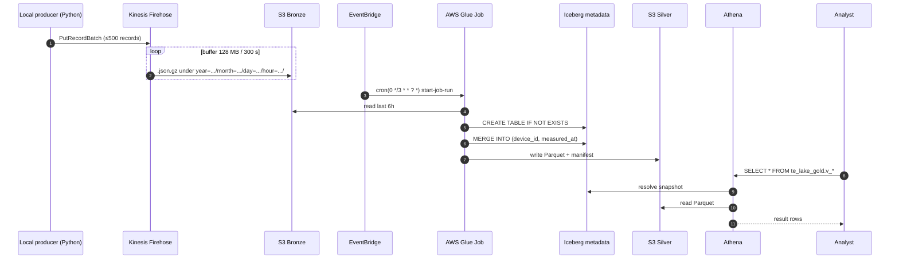

# Architecture

Deeper dive than the top-level README. Pairs with the DESIGN document in
`.claude/sdd/features/DESIGN_aws-data-lakehouse.md`.

## End-to-end flow

## Layer contracts

### Bronze

| Aspect | Value |
|---|---|
| Format | JSON Lines, GZIP (Firehose-managed) |
| Path | `s3://<landing>/instantaneous/year=YYYY/month=MM/day=DD/hour=HH/` |
| Partition time | Firehose **delivery time** (not event time) |
| Schema | Whatever `InstantaneousData.to_json()` produces |
| Retention | 7 days (lifecycle rule) |
| Quality gate | None — raw-only |

### Silver — `te_lake_silver.instantaneous_measurements`

| Aspect | Value |
|---|---|
| Format | Iceberg v2, Parquet data, Zstd compression |
| Partition spec | `PARTITIONED BY (measured_date, bucket(8, device_id))` |
| Derived columns | `measured_date = DATE(measured_at)`, `_ingested_at = current_timestamp()` |
| Idempotency | `MERGE INTO ON (device_id, measured_at)` |
| Quality gate | Filter null PKs, dedup on PK, permissive JSON parse |
| Retention | Indefinite while stack is applied |

### Gold — Athena views

| View | Grain | Source |
|---|---|---|
| `v_hourly_energy` | device × date × hour | Silver |
| `v_daily_device_summary` | device × date | Silver |
| `v_fleet_daily_rollup` | fleet × date | `v_daily_device_summary` |

No storage cost — views materialize on query.

## Key decisions (summary)

Full rationale in DESIGN doc. Short form:

1. **Glue 5.0 + bundled Iceberg** — no custom JARs; enable via `--datalake-formats iceberg`.
2. **Delivery-time Bronze partitioning, event-time Silver** — Firehose default prefix; Glue re-partitions via `measured_date`.
3. **Iceberg table created by Glue job, not Terraform** — Terraform owns the Glue database and uses a `null_resource` destroy-hook to drop the table before the database goes. Sidesteps the AWS-provider idiosyncrasies around `open_table_format_input.iceberg_input`.
4. **Views via `null_resource` + `local-exec`** — simpler than Glue `VIRTUAL_VIEW` and keeps DDL as first-class SQL.
5. **Athena workgroup scan-cap = 1 GiB** — hard safety against runaway `SELECT *`.
6. **Silver partition `measured_date` + `bucket(8, device_id)`** — daily pruning + device parallelism without thousands of small-file partitions.
7. **Local Terraform state** — nothing orphan-survives `terraform destroy`.
8. **IAM user for producer with static access keys** — simplest least-privilege pattern that supports an off-AWS producer; key rotates on each apply.
9. **Firehose 128 MB / 300 s / GZIP** — time buffer always fires first at demo volume.
10. **Capability-based modules** — `storage`, `ingestion`, `catalog`, `etl`, `query`, `observability` — IAM lives beside the consumer.

## Cost model (7-day demo)

| Service | Driver | Cost |
|---|---|---|
| Firehose | ~100 MB ingested × $0.029/GB | < $0.01 |
| S3 storage | ~50 MB avg across 3 buckets | < $0.01 |
| S3 requests | ~ hundreds per day | < $0.05 |
| Glue Job | 2 DPU × 5 min × 8 runs/day × 7 d × $0.44/DPU-hr | ~$2.05 |
| Athena | < 100 MB scanned per query × ~50 queries | < $0.01 |
| EventBridge, SNS, CW Logs | within free tier | $0.00 |
| **Total** | | **~$2.12** |

Headroom vs $10 budget: ~$7.88. A 30-day idle run (no producer, 8 Glue runs/day reading empty Bronze, view queries sparse) comes in at ~$9 — Budgets will alert before it hits $10.

## Observability

| Signal | Where |
|---|---|
| Firehose delivery errors | `/aws/kinesisfirehose/<prefix>-instant-stream` CloudWatch log group |
| Glue job stdout / Spark logs | `/aws-glue/jobs/output` (Glue default) |
| Glue metrics | `--enable-metrics true` → CloudWatch `Glue/*` namespace |
| Athena query history | Athena console → workgroup → Recent queries |
| Cost | AWS Budgets (email at 50/80/100 %) |
| Cost (drill-down) | Cost Explorer filter: `user:Project=<project_name>` |

## Schema evolution

| Change | Path |
|---|---|
| New column in `InstantaneousData` | Add to `build_schema()` in the Glue script + to `CREATE TABLE` DDL; Iceberg handles it online |
| Type widening | Supported natively by Iceberg (INT → BIGINT etc.) |
| Partition spec change | Iceberg v2 supports spec evolution via `ALTER TABLE ... REPLACE PARTITION FIELD`; run via Athena |
| Gold view change | Edit `terraform/modules/query/views/*.sql.tftpl` → `terraform apply` (triggers `null_resource` re-fire) |

## Security posture

- All 3 S3 buckets: public-access block = ON, SSE-S3 encryption, `force_destroy = true`
- Least-privilege IAM: producer user limited to `firehose:PutRecord*` on one stream ARN; Glue role limited to specific buckets and Glue Catalog actions
- No KMS CMK (would cost $1/key/month — eats budget). Default SSE-S3 is acceptable for demo data.
- No VPC — all services are AWS-managed endpoints with TLS in transit
- `.gitignore` covers `*.tfstate*`, `*.tfvars`, `.terraform/`; producer access key is a `sensitive` Terraform output

## Known limitations / future work

- **`SyncParametersData` and `DeviceData` ingestion** — producer currently only emits `InstantaneousData`.
- **Data quality framework** — Glue Data Quality or Great Expectations not wired up; inline filters only.
- **Column-level lineage tool** (OpenMetadata/DataHub) — not configured.
- **Production-grade hardening** — no KMS CMK per bucket, no CloudTrail data events, no GuardDuty.
- **Multi-environment** (dev/stg/prod) — single environment by design.
- **Remote Terraform state** — local state preserves the "fully destroyable" property.
